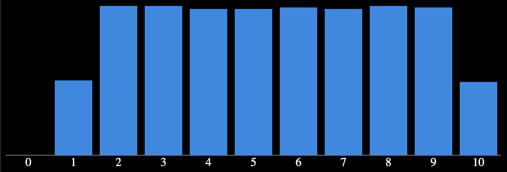

# Javascript's RNG

I'll caveat this whole document with, "someone's probably already done this but I wanted to do it myself".

## The hypothesis

Javascript's RNG generates numbers on a flat probability curve. Meaning, if we are trying to generate 100 numbers in the range of 1 through 15 inclusive, the numbers will generate with an equal distribution.

## The experiment

Pretty simple experiment here. Generate 10,000 numbers between 1 and 100 and see what the probability curve looks like. As an addendum, generate 10,000 numbers between 1 and 10 and see what the probability curve looks like for smaller ranges. Another potential variable that we can look at is if the `worker_threads` module makes any difference.

### The generation code

```typescript
const minRange = 0;
const maxRange = 11;

const results: number[] = new Array(maxRange + 1).fill(0);

const getRandomNumber = (min: number, max: number): number => {
  return Math.round(Math.random() * (max - min) + min);
};

for (let i = 0; i < 10000; i++) {
  const num = getRandomNumber(minRange, maxRange);
  results[num] += 1;
}
```

## The data

```typescript
console.log(results); // for range 1 through 10
// [0,  5423, 11016, 11057, 11230, 11220, 11180, 11033, 11131,11217,  5493]
```

```typescript
console.log(results); // for range 1 through 20
// [ 0, 2601, 5170, 5227, 5329, 5250, 5298, 5353, 5289, 5172, 5246, 5333, 5133, 5233, 5348, 5287, 5276, 5229, 5294, 5344, 2588]
```

## The analysis

As can be seen from the sample data added above, the random number generation about equally likely to generate every number in the range except for the bounds. Practically, this means that the bounds of each column in the bingo card are less likely to show up on the card.

### The bar chart generation code

```typescript
import { writeChartFile, buildChart } from './utils';

(async () => {
  // data generation code

  const chart = buildChart(results);

  await writeChartFile('docs/output.html', chart);
})();
```

### Sample data chart


